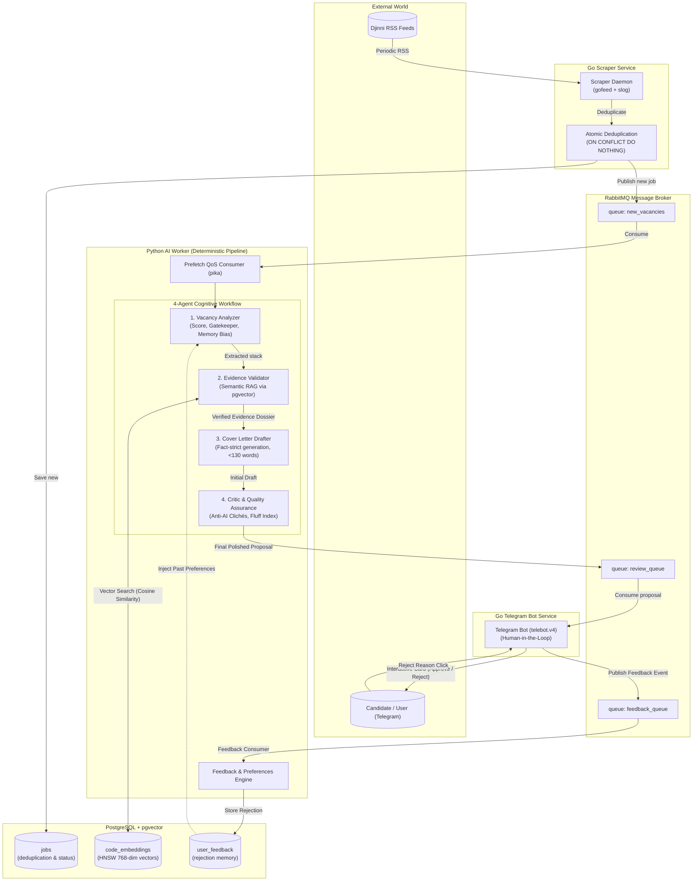

# ⚡ Autonomous Freelance & Job Bidder Agent

> **Production-grade, polyglot (Go + Python) event-driven autonomous agent system for automated vacancy scraping, RAG fact-checking with pgvector, multi-agent AI proposal drafting, and Human-in-the-Loop review via Telegram.**

[](https://go.dev/)
[](https://python.org/)
[](https://github.com/pgvector/pgvector)
[](https://www.rabbitmq.com/)
[](https://www.docker.com/)
[](https://ai.google.dev/)

---

## 🏛️ System Architecture

The project is built as a **polyglot microservices monorepo**. Fast I/O tasks (scraping and Telegram bot) are isolated in **Go**, while heavy AI orchestration, semantic RAG vector retrieval, and reflection pipelines are managed in **Python**. Services communicate asynchronously over **RabbitMQ**.



---

## 🚀 Key Engineering Highlights

### 1. Deterministic 4-Agent Pipeline (No Chaotic Autonomous Tool Calling)
Rather than giving an autonomous agent unconstrained tool execution permissions (which burns tokens and introduces infinite hallucination loops), this system implements a strict, sequential **Actor-Critic assembly line**:
* **Agent 1: Vacancy Analyzer** — Acts as a front-line technical recruiter. Quickly parses the requirements into a strictly typed Pydantic schema, calculates a fit score (0-100), and rejects non-matching vacancies (`decision: SKIP`) in <1 second.
* **Agent 2: Evidence Validator (pgvector RAG)** — Queries a PostgreSQL vector database using cosine distance (`<=>`) to verify whether the candidate *actually* implemented the required technologies in past codebases (`SplitCore`, `Freelance Agent`). Produces an **Evidence Dossier** of hard facts.
* **Agent 3: Cover Letter Drafter** — Writes a concise (<120 words), peer-to-peer cover letter based **strictly** on the verified facts from Agent 2. Gaps are acknowledged transparently without corporate fluff.
* **Agent 4: Critic & Quality Assurance** — An anti-AI filter. Calculates a `fluff_percentage`, detects and purges typical LLM hallmarks (*"thrilled"*, *"delve"*, *"testament"*, *"spearhead"*), checks grammar, and outputs the final production letter.

### 2. Semantic RAG with `pgvector` & HNSW Indexing
* Knowledge chunks from the candidate's real production repositories are embedded using Google's `gemini-embedding-001` (compressed to 768 dimensions).
* Stored in PostgreSQL with a dedicated **Hierarchical Navigable Small World (HNSW)** index: `USING hnsw (embedding vector_cosine_ops)`.
* **Self-Healing Architecture:** On startup, the Python worker automatically detects if the vector database is empty and triggers background re-indexing automatically.

### 3. Human-in-the-Loop (HITL) & Adaptive Memory
* Proposals are pushed to Telegram via `gopkg.in/telebot.v4`.
* Proposals feature **one-click tap-to-copy** formatting (`<code>`), an `[Approve]` action, and an interactive `[Reject]` menu with concrete reasons (*"Low salary / Too senior"*, *"Mismatched stack"*, *"Boring domain"*).
* Rejections are published to RabbitMQ `feedback_queue`, stored in `user_feedback`, and dynamically injected into Agent 1's system prompt on subsequent cycles to bias scoring against rejected patterns.

---

## 🛠️ Tech Stack

| Component | Technology | Rationale |
| :--- | :--- | :--- |
| **Scraper** | Go 1.24, `gofeed`, `cleanenv`, `slog` | Blazing-fast XML parsing, minimal memory footprint, strict typing. |
| **AI Worker** | Python 3.12, `google-genai`, `pydantic` | Rich AI ecosystem, Structured Outputs, fast prototyping. |
| **Telegram Bot**| Go 1.24, `telebot.v4` | High concurrency, native goroutine handling for Telegram polling. |
| **Message Broker** | RabbitMQ 4.x (AMQP 0.9.1) | Reliable durable queues, prefetch QoS buffering, decoupling I/O from LLM latency. |
| **Vector DB** | PostgreSQL 16 + `pgvector` | Unified relational + semantic storage without needing separate vector databases (Pinecone/Milvus). |
| **Deployment** | Docker, Docker Compose, Makefile | Isolated multi-stage containers with non-root security. |

---

## ⚡ Quickstart

### 1. Prerequisites
* [Docker](https://docs.docker.com/get-docker/) & Docker Compose installed.
* [Google AI Studio API Key](https://aistudio.google.com/app/apikey) (free tier is fully sufficient).
* Telegram Bot Token (from `@BotFather`) and your Telegram User ID (from `@userinfobot`).

### 2. Configure Environment
Clone the repository and copy the environment template:
```bash
git clone https://github.com/ganfay/work-agent-bot.git
cd work-agent-bot
cp .env.example .env
```

Fill in `.env`:
```env
# Database Credentials
PG_USER=postgres
PG_PASSWORD=your_secret_password
PG_DB=bidder_db

# RabbitMQ Credentials
RMQ_USER=guest
RMQ_PASS=guest

# AI & Telegram
GEMINI_API_KEY=your_gemini_api_key_here
TG_BOT_TOKEN=your_telegram_bot_token_here
TG_USER_ID=your_numerical_telegram_id_here
```

### 3. Customize Candidate Profile
Edit `candidate_profile.json` in the root folder with your target tech stack, seniority level, and code project achievements:
```json
{
  "target_role": "Junior Go Developer",
  "baseline_prompt": "CANDIDATE BASELINE: ...",
  "knowledge_chunks": [ ... ]
}
```

### 4. Build and Run Entire Monorepo
Start all 5 services with one command using the Master Makefile:
```bash
make up
```

Stream live logs across all microservices:
```bash
make logs
```

To stop all services:
```bash
make down
```

---

## 📋 Master Control Commands

```bash
make up             # Build and start all 5 containers in background
make down           # Stop all running containers
make restart        # Restart all services
make ps             # View container status and healthchecks
make logs           # Combined live logs
make logs-ai        # Stream logs from Python AI Worker exclusively
make logs-bot       # Stream logs from Go Telegram Bot exclusively
make logs-scraper   # Stream logs from Go Djinni Scraper exclusively
make migrate-up     # Apply database migrations
make index          # Manually trigger pgvector re-indexing
make clean          # Purge containers, volumes, and temporary caches
```

---

## 🗺️ Roadmap (v2.0 Vision)

- [ ] **Multi-Tenant SaaS Architecture:** User registration via Telegram `/onboard` wizard with per-user schema isolation.
- [ ] **Automated Code Harvester:** GitHub Webhook / Action integration to parse candidate repos via AST, automatically updating `pgvector` upon every `git push`.
- [ ] **Direct Application Dispatch:** Playwright / Selenium browser sidecar for 1-click automatic submission directly into Djinni job applications upon user confirmation.

---

## 👨‍💻 Author

**Maksym Biesiedin ([[ganfay]])**  
*Go Backend & Systems Engineer \| KSE Delta Engineering '28*  
[GitHub Profile](https://github.com/ganfay)
